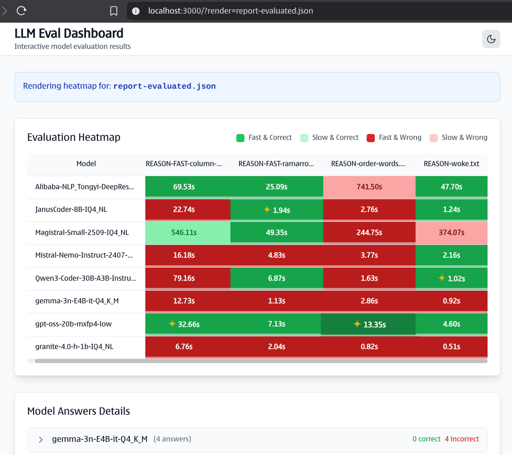

# LLM Eval Simple



A simple tool for evaluating Large Language Models (LLMs) using a set of prompts and expected answers. It supports testing multiple models via an OpenAI-compatible API endpoint, measures response times, evaluates correctness (using an optional evaluator model or exact matching), and generates a summary report in tabular format.

This script is useful for benchmarking LLM performance on custom datasets, such as accuracy on specific tasks or questions.

## Features

- Batch testing of multiple models.
- Automatic evaluation using an evaluator model or fallback to exact string matching.
- Response time tracking.
- Detailed per-prompt results and aggregated summary tables.
- Configurable via environment variables (e.g., model names, API endpoint).

## Prerequisites

- Python 3.8+.
- [uv](https://github.com/astral-sh/uv) installed for dependency management (a fast alternative to pip and venv).
- Access to an OpenAI-compatible API endpoint (e.g., local server or hosted service) for model inference.
- Directories for prompts and answers (created automatically if missing).

## Installation

1. Clone the repository:

   ```bash
   git clone <repository-url>
   cd llm-eval-simple
   ```

2. Install dependencies using uv:

   ```bash
   uv sync
   ```

   This will create a virtual environment and install all required packages from `pyproject.toml` or `requirements.txt`.

   If you prefer not to use uv, you can manually install dependencies:

   ```bash
   python -m venv .venv
   source .venv/bin/activate  # On Unix-based systems
   # or .venv\Scripts\activate on Windows
   pip install -r requirements.txt
   ```

   Note: The script assumes uv for running, but you can adapt it for standard Python.

## Configuration

1. Create a `.env` file in the root directory based on `.env.example`:

   ```bash
   cp .env.example .env
   ```

   Edit `.env` with your settings:
   - `ENDPOINT_URL`: Your OpenAI-compatible API endpoint (default: `http://localhost:9292/v1/chat/completions`).
   - `API_KEY`: Your API key for authentication with the OpenAI-compatible API (optional).
   - `MODEL_NAMES`: Comma-separated list of model names to test (e.g., `gemma-3-270m-it-Q4_K_M,Qwen3-8B-Q4_K_M`).
   - `MODEL_EVALUATOR`: Optional model name for evaluating correctness (if empty, uses exact matching).

2. Prepare your test data:
   - Place prompt files in the `prompts` directory (e.g., `1-math-question.txt`).
   - Place corresponding expected answer files in the `answers` directory with matching names (e.g., `1-math-question.txt`).
   - Files should contain plain text: prompts for input to the model, answers for comparison.
   - Use consistent naming and ensure files are UTF-8 encoded.

## Usage

### Running Evaluations

Run the evaluation script:

```bash
uv run python main.py
# you can activate the actions separately and also the prompts
uv run main.py --actions answer,evaluate,serve --pattern "prompts/REASON*"
```

### Starting the Dashboard

For a web-based dashboard to view results, use the `start-dashboard.sh` script:

```bash
./start-dashboard.sh
```

This will start:
- API server on port 4000
- Web UI on port 3000

Alternatively, start components manually:
```bash
# Start API server
uv run python api_server.py

# Start web UI (in another terminal)
cd frontend && npm run dev
```

- This will process all prompt files, test each model, evaluate results, and print detailed per-file results followed by a summary table.
- Output includes:
  - Per-model testing logs.
  - Detailed table with model, file, correctness, and response time.
  - Summary table with accuracy percentage and average response time.

Example output snippet:

```text
...
├────────────────────────────────┼───────────────────────────────┼───────────┼─────────────────┤
│ gemma-3-27b-it-qat-q4_0-q3_k_m │ REASON-column-words.txt       │ 𐄂         │ 14.53s          │
├────────────────────────────────┼───────────────────────────────┼───────────┼─────────────────┤
│ gemma-3-27b-it-qat-q4_0-q3_k_m │ REASON-ramarronero.txt        │ 𐄂         │ 5.85s           │
├────────────────────────────────┼───────────────────────────────┼───────────┼─────────────────┤
│ gpt-oss-20b-mxfp4              │ 1-capital-italy.txt           │ 🮱         │ 26.83s          │
├────────────────────────────────┼───────────────────────────────┼───────────┼─────────────────┤
│ gpt-oss-20b-mxfp4              │ BIGCONTEXT-kuleba.txt         │ 🮱         │ 48.03s          │
├────────────────────────────────┼───────────────────────────────┼───────────┼─────────────────┤
│ gpt-oss-20b-mxfp4              │ CODING-typescript-rust.txt    │ 🮱         │ 33.07s          │
├────────────────────────────────┼───────────────────────────────┼───────────┼─────────────────┤
│ gpt-oss-20b-mxfp4              │ EXTRACT-USDT-APY.txt          │ 🮱         │ 133.22s         │
├────────────────────────────────┼───────────────────────────────┼───────────┼─────────────────┤
│ gpt-oss-20b-mxfp4              │ KNOWLEDGE-translate-pesca.txt │ 🮱         │ 18.67s          │
├────────────────────────────────┼───────────────────────────────┼───────────┼─────────────────┤
│ gpt-oss-20b-mxfp4              │ MATH-battery-discarge.txt     │ 🮱         │ 29.25s          │
├────────────────────────────────┼───────────────────────────────┼───────────┼─────────────────┤
│ gpt-oss-20b-mxfp4              │ REASON-column-words.txt       │ 🮱         │ 81.82s          │
├────────────────────────────────┼───────────────────────────────┼───────────┼─────────────────┤
│ gpt-oss-20b-mxfp4              │ REASON-ramarronero.txt        │ 🮱         │ 16.90s          │
╘════════════════════════════════╧═══════════════════════════════╧═══════════╧═════════════════╛

Model Performance Summary
╒════════════════════════════════╤═══════════════════════════╤═════════════════════╕
│ Model                          │ Correct                   │ Avg Response Time   │
╞════════════════════════════════╪═══════════════════════════╪═════════════════════╡
│ Qwen3-4B-IQ4_NL                │ 5/8 (62.5%) [██████░░░░]  │ 87.92s              │
├────────────────────────────────┼───────────────────────────┼─────────────────────┤
│ gemma-3-27b-it-qat-q4_0-q3_k_m │ 6/8 (75.0%) [███████░░░]  │ 112.57s             │
├────────────────────────────────┼───────────────────────────┼─────────────────────┤
│ gpt-oss-20b-mxfp4              │ 8/8 (100.0%) [██████████] │ 48.47s              │
╘════════════════════════════════╧═══════════════════════════╧═════════════════════╛
```

## Troubleshooting

- **API Errors**: Ensure your endpoint is running and accessible. Check the URL and model names in `.env`.
- **Evaluator Failures**: If using `MODEL_EVALUATOR`, it should return "CORRECT" or "INCORRECT". The script now handles variations like "not correct".
- **No Matching Answers**: The script skips prompts without corresponding answer files.
- **Dependencies**: If uv is not installed, download it from [astral-sh/uv](https://github.com/astral-sh/uv).
- **Customization**: Modify `main.py` for advanced features, like adding more metrics or output formats.

## Contributing

Feel free to open issues or pull requests for improvements.

## License

MIT License. See [`LICENSE`](LICENSE) for details.
